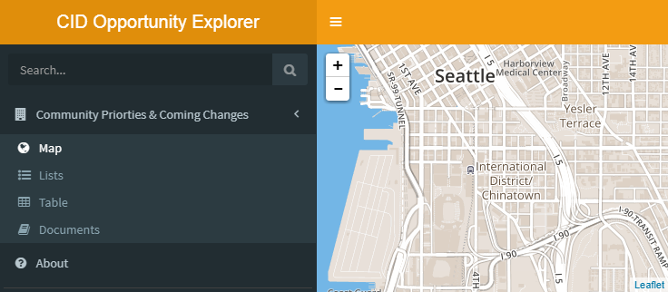

Opportunity Map
---------------

<!--html_preserve-->
<i class="fa fa-exclamation-triangle"></i><!--/html_preserve--> This project brings together information about upcoming changes to a neighborhood and overlays past visions and plans created by the community.

This is intended to be a proof of concept not a finished product. Please note that it is not yet suitable for public distribution.

#### The App

The app is written in R and published to the free tier of RStudio's Shinyapps.io server. The app can be run locally by downloading this Github repository and running the provided `launch_application()` function:

``` r
devtools::install_github('tiernanmartin/shiny.OpportunityMap')
launch_app(pkg_name = 'shiny.OpportunityMap')
```



#### User Guide

*add details here*

#### App Directory

    .
    ├── inst/
    │   └── application/
    │       ├── global.R
    │       ├── server.R
    │       ├── ui.R
    │       └── www/
    │           ├── content/
    │           ├── data/
    │           ├── css/
    │           └── images/
    ├── man/
    └── R/
